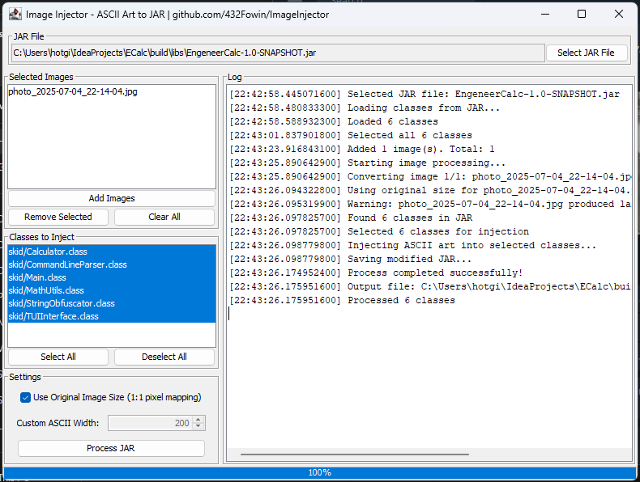
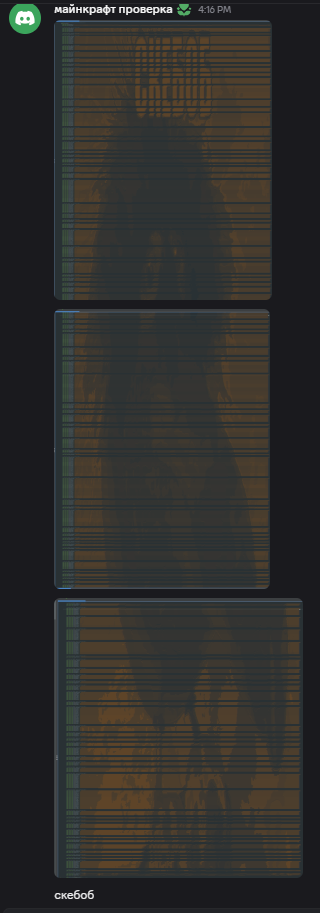

# 🎨 ImageInjector - ASCII Art JAR Injector

[](README_EN.md) | [](README_RU.md)

---

## 🌍 Language / Язык

- **[🇺🇸 English Version](README_EN.md)**
- **[🇷🇺 Русская версия](README_RU.md)**

---

## 📖 Quick Overview / Краткий обзор

**ImageInjector** is a powerful Java tool that converts images to ASCII art and injects them into JAR files as static string fields. This tool is perfect for adding visual elements, watermarks, or artistic touches to your Java applications.

**ImageInjector** - это мощный Java-инструмент, который конвертирует изображения в ASCII-арт и внедряет их в JAR-файлы как статические строковые поля. Этот инструмент идеально подходит для добавления визуальных элементов, водяных знаков или художественных штрихов в ваши Java-приложения.

---

## 🚀 Key Features / Ключевые возможности

### English:
- **🖼️ Image to ASCII Conversion**: Convert PNG, JPG, GIF, BMP images to ASCII art
- **🎯 Selective Class Injection**: Choose specific classes for ASCII art injection
- **⚙️ Flexible Sizing Options**: Use original image size or custom width
- **🖥️ User-Friendly GUI**: Intuitive graphical interface
- **📦 JAR Processing**: Load, modify, and save JAR files seamlessly
- **🔄 Batch Processing**: Handle multiple images simultaneously

### Русский:
- **🖼️ Конвертация изображений в ASCII**: Преобразование PNG, JPG, GIF, BMP в ASCII-арт
- **🎯 Селективное внедрение в классы**: Выбор конкретных классов для внедрения ASCII-арт
- **⚙️ Гибкие настройки размера**: Использование оригинального размера или пользовательской ширины
- **🖥️ Удобный GUI**: Интуитивно понятный графический интерфейс
- **📦 Обработка JAR**: Загрузка, изменение и сохранение JAR-файлов
- **🔄 Пакетная обработка**: Обработка нескольких изображений одновременно

---

## 📸 Screenshots / Скриншоты

### Main Interface / Основной интерфейс


### Example Output / Пример результата


---

## 🛠️ Quick Start / Быстрый старт

### Download / Скачать
Get the pre-built JAR: **`ImageInjector-1.0-java21-with-dependencies.jar`**

Скачайте готовый JAR: **`ImageInjector-1.0-java21-with-dependencies.jar`**

### Run / Запуск
```bash
java -jar ImageInjector-1.0-java21-with-dependencies.jar
```

---

## 📋 System Requirements / Системные требования

- **Java**: 21 or higher / 21 или выше
- **OS**: Windows, macOS, Linux
- **Memory**: 512MB RAM minimum / минимум 512МБ ОЗУ

---

## 🔧 Build from Source / Сборка из исходного кода

### Prerequisites / Предварительные требования
- Java 21+
- Gradle 7.0+

### Build Steps / Шаги сборки
```bash
# Clone repository / Клонировать репозиторий
git clone https://github.com/432Fowin/ImageInjector.git
cd ImageInjector

# Build with dependencies / Сборка с зависимостями
./gradlew shadowJar

# Run / Запуск
java -jar build/libs/ImageInjector-1.0-SNAPSHOT-all.jar
```

---

## 📚 Documentation / Документация

### 📖 Main Documentation / Основная документация
| English | Русский | Description / Описание |
|---------|---------|------------------------|
| [🇺🇸 **Complete Guide**](README_EN.md) | [🇷🇺 **Полное руководство**](README_RU.md) | Full documentation / Полная документация |
| [📚 **Tutorial & Examples**](TUTORIAL.md) | [📚 **Туториал и примеры**](TUTORIAL_RU.md) | Step-by-step guides / Пошаговые руководства |
| [💡 **Code Examples**](EXAMPLES.md) | [💡 **Примеры кода**](EXAMPLES.md) | Real-world usage examples / Примеры реального использования |
| [🔨 **Build Guide**](BUILD_GUIDE.md) | [🔨 **Руководство по сборке**](BUILD_GUIDE.md) | Detailed build instructions / Подробные инструкции по сборке |
| [🔧 **Technical Specs**](TECHNICAL_SPECS.md) | [🔧 **Технические спецификации**](TECHNICAL_SPECS.md) | API & Architecture / API и архитектура |

### 🎯 Quick Links / Быстрые ссылки
- **🚀 [Getting Started](README_EN.md#-installation) / [Начало работы](README_RU.md#-установка)**
- **📖 [Basic Tutorial](TUTORIAL.md#-tutorial-1-basic-ascii-art-injection) / [Базовый туториал](TUTORIAL_RU.md#-туториал-1-базовое-внедрение-ascii-арт)**
- **🔧 [Build Instructions](BUILD_GUIDE.md#-quick-build) / [Инструкции по сборке](BUILD_GUIDE.md#-quick-build)**
- **🐛 [Troubleshooting](TUTORIAL.md#-troubleshooting-common-issues) / [Решение проблем](TUTORIAL_RU.md#-решение-распространенных-проблем)**
- **📝 [Changelog](CHANGELOG.md) / [История изменений](CHANGELOG.md)**

---

## 🤝 Contributing / Участие в разработке

Contributions are welcome! Please read our contributing guidelines.

Мы приветствуем участие в разработке! Пожалуйста, ознакомьтесь с нашими рекомендациями.

---

## 📄 License / Лицензия

This project is open source. See LICENSE file for details.

Этот проект имеет открытый исходный код. Подробности в файле LICENSE.

---

## 👨‍💻 Author / Автор

**GitHub**: [432Fowin](https://github.com/432Fowin)

---

⭐ **Star this repository if you find it useful! / Поставьте звезду, если проект полезен!**
