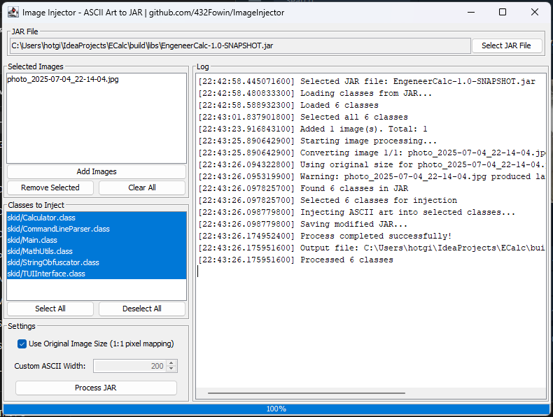

# 🎨 ImageInjector - ASCII Art JAR Injector

[](README.md) | [](README_RU.md)

---

## 📖 Table of Contents

- [Overview](#-overview)
- [Features](#-features)
- [Screenshots](#-screenshots)
- [How It Works](#-how-it-works)
- [Installation](#-installation)
- [Usage Guide](#-usage-guide)
- [Code Examples](#-code-examples)
- [Building from Source](#-building-from-source)
- [Technical Details](#-technical-details)
- [Dependencies](#-dependencies)
- [Troubleshooting](#-troubleshooting)

---

## 🌟 Overview

**ImageInjector** is a sophisticated Java application that transforms images into ASCII art and seamlessly injects them into JAR files as static string fields. This tool is perfect for:

- **Software Watermarking**: Add unique visual signatures to your applications
- **Easter Eggs**: Hide artistic elements in your code
- **Debugging Aids**: Visual markers for different builds or versions
- **Artistic Code**: Add creative flair to your Java projects

### What makes ImageInjector special?

- **High-Quality ASCII Conversion**: Advanced algorithms for optimal ASCII art generation
- **Selective Injection**: Choose exactly which classes to modify
- **Non-Destructive**: Original JAR structure and functionality preserved
- **Batch Processing**: Handle multiple images efficiently
- **User-Friendly**: Intuitive GUI for easy operation

---

## ✨ Features

### 🖼️ Image Processing
- **Multiple Formats**: Support for PNG, JPG, JPEG, GIF, BMP
- **Smart Resizing**: Automatic optimization for large images
- **Quality Control**: Bicubic interpolation for smooth ASCII conversion
- **Size Options**: Original size (1:1 pixel mapping) or custom width

### 🎯 JAR Manipulation
- **Class Selection**: Pick specific classes for injection
- **ASM Integration**: Uses ObjectWeb ASM for bytecode manipulation
- **Resource Preservation**: All non-class files remain intact
- **Output Control**: Creates new JAR with "_injected" suffix

### 🖥️ User Interface
- **Modern GUI**: Clean, intuitive Swing interface
- **Real-time Logging**: Monitor processing progress
- **Drag & Drop**: Easy file selection
- **Progress Tracking**: Visual feedback during operations

---

## 📸 Screenshots

### Main Application Window


The interface consists of several key sections:
1. **JAR File Selection**: Choose your target JAR file
2. **Image Management**: Add, remove, and manage images
3. **Class Selection**: Pick which classes to inject into
4. **Settings Panel**: Configure ASCII conversion options
5. **Log Output**: Real-time processing feedback

### Example ASCII Art Output


---

## 🔧 How It Works

ImageInjector follows a sophisticated multi-step process:

### 1. Image Analysis & Conversion
```java
// Core conversion algorithm
public static String convertImageToAscii(File imageFile, int width) throws IOException {
    BufferedImage image = ImageIO.read(imageFile);
    
    // Smart resizing with quality preservation
    BufferedImage resizedImage = new BufferedImage(targetWidth, targetHeight, BufferedImage.TYPE_INT_RGB);
    Graphics2D g2d = resizedImage.createGraphics();
    g2d.setRenderingHint(RenderingHints.KEY_INTERPOLATION, RenderingHints.VALUE_INTERPOLATION_BICUBIC);
    
    // Convert to grayscale and map to ASCII characters
    for (int y = 0; y < targetHeight; y++) {
        for (int x = 0; x < targetWidth; x++) {
            int gray = calculateGrayscale(resizedImage.getRGB(x, y));
            ascii.append(ASCII_CHARS.charAt(mapToAsciiIndex(gray)));
        }
    }
}
```

### 2. JAR File Processing
```java
// Load and parse JAR structure
public void loadJar(File jarFile) throws IOException {
    try (JarFile jar = new JarFile(jarFile)) {
        Enumeration<JarEntry> entries = jar.entries();
        while (entries.hasMoreElements()) {
            JarEntry entry = entries.nextElement();
            if (entry.getName().endsWith(".class")) {
                // Parse class files using ASM
                ClassReader reader = new ClassReader(inputStream);
                ClassNode classNode = new ClassNode();
                reader.accept(classNode, 0);
                classes.put(entry.getName(), classNode);
            }
        }
    }
}
```

### 3. ASCII Art Injection
```java
// Inject ASCII art as static fields
public void addString(ClassNode classNode, String value) {
    classNode.fields.add(new FieldNode(
        ACC_PUBLIC + ACC_STATIC + ACC_FINAL,
        generateRandomFieldName(),
        "Ljava/lang/String;",
        null,
        value  // ASCII art line
    ));
}
```

---

## 🚀 Installation

### Option 1: Pre-built JAR (Recommended)
1. Download `ImageInjector-1.0-java21-with-dependencies.jar`
2. Ensure Java 21+ is installed
3. Run: `java -jar ImageInjector-1.0-java21-with-dependencies.jar`

### Option 2: Build from Source
See [Building from Source](#-building-from-source) section below.

---

## 📖 Usage Guide

### Step 1: Launch Application
```bash
java -jar ImageInjector-1.0-java21-with-dependencies.jar
```

### Step 2: Select JAR File
1. Click "Select JAR File" button
2. Choose your target JAR file
3. Wait for class loading to complete

### Step 3: Add Images
1. Click "Add Images" button
2. Select one or more image files (PNG, JPG, GIF, BMP)
3. Images will appear in the list

### Step 4: Configure Settings
- **Use Original Size**: Check for 1:1 pixel mapping
- **Custom Width**: Uncheck and set desired ASCII width (50-1000)

### Step 5: Select Classes
1. Choose which classes to inject ASCII art into
2. Use "Select All" or "Deselect All" for bulk operations
3. Hold Ctrl/Cmd for multiple selections

### Step 6: Process JAR
1. Click "Process JAR" button
2. Monitor progress in the log area
3. Output JAR will be saved with "_injected" suffix

---

## 💻 Code Examples

### ASCII Art Transformer
```java
public class ASCIIArtTransformer extends Transformer {
    private final String[] asciiImages;
    private final Set<String> selectedClassNames;
    
    @Override
    public void visit(ClassNode classNode) {
        String currentAscii = asciiImages[currentImageIndex];
        String[] lines = currentAscii.split("\n");
        
        // Add each line as a separate static field
        for (String line : lines) {
            if (!line.trim().isEmpty()) {
                addString(classNode, line);
            }
        }
    }
}
```

### Image to ASCII Conversion
```java
public class ImageToAscii {
    private static final String ASCII_CHARS = "@#S%?*+;:,. ";
    
    public static String convertImageToAscii(File imageFile, int width) {
        // Load and resize image
        BufferedImage image = ImageIO.read(imageFile);
        BufferedImage resized = resizeImage(image, width);
        
        // Convert each pixel to ASCII character
        StringBuilder ascii = new StringBuilder();
        for (int y = 0; y < resized.getHeight(); y++) {
            for (int x = 0; x < resized.getWidth(); x++) {
                int gray = calculateGrayscale(resized.getRGB(x, y));
                ascii.append(mapToAsciiChar(gray));
            }
            ascii.append("\n");
        }
        return ascii.toString();
    }
}
```

---

## 🔨 Building from Source

### Prerequisites
- **Java Development Kit**: 21 or higher
- **Gradle**: 7.0 or higher (or use included wrapper)

### Clone Repository
```bash
git clone https://github.com/432Fowin/ImageInjector.git
cd ImageInjector
```

### Build Commands
```bash
# Clean previous builds
./gradlew clean

# Compile and run tests
./gradlew build

# Create JAR with dependencies
./gradlew shadowJar

# Run application
./gradlew run
```

### Build Output
- **Standard JAR**: `build/libs/ImageInjector-1.0-SNAPSHOT.jar`
- **Fat JAR**: `build/libs/ImageInjector-1.0-SNAPSHOT-all.jar`

---

## 🔧 Technical Details

### Architecture
- **Language**: Java 21
- **GUI Framework**: Swing
- **Bytecode Manipulation**: ObjectWeb ASM 9.6
- **Build System**: Gradle with Shadow plugin
- **Image Processing**: Java AWT/BufferedImage

### Key Components
1. **Main.java**: Application entry point and GUI initialization
2. **ImageInjectorGUI.java**: User interface and event handling
3. **Jar.java**: JAR file loading, processing, and saving
4. **ASCIIArtTransformer.java**: Bytecode transformation logic
5. **ImageToAscii.java**: Image to ASCII conversion algorithms

### Performance Considerations
- **Memory Usage**: Optimized for large images with automatic resizing
- **Processing Speed**: Multi-threaded operations for responsiveness
- **File Size**: ASCII art is compressed as string literals

---

## 📦 Dependencies

### Runtime Dependencies
```gradle
dependencies {
    implementation 'org.ow2.asm:asm:9.6'
    implementation 'org.ow2.asm:asm-commons:9.6'
    implementation 'org.ow2.asm:asm-tree:9.6'
    implementation 'org.ow2.asm:asm-util:9.6'
}
```

### Build Dependencies
- **Shadow Plugin**: For creating fat JARs
- **Gradle Wrapper**: Included for consistent builds

---

## 🐛 Troubleshooting

### Common Issues

**Q: Application won't start**
A: Ensure Java 21+ is installed and JAVA_HOME is set correctly

**Q: Images not converting properly**
A: Check image format (PNG, JPG, GIF, BMP supported) and file permissions

**Q: JAR processing fails**
A: Verify JAR file is not corrupted and you have write permissions

**Q: ASCII art too large**
A: Use custom width setting or enable automatic resizing

**Q: Classes not showing**
A: Ensure JAR contains valid Java class files

### Performance Tips
- Use smaller images for faster processing
- Enable original size only for small images
- Process fewer classes at once for large JARs

---

## 🤝 Contributing

We welcome contributions! Please:
1. Fork the repository
2. Create a feature branch
3. Make your changes
4. Add tests if applicable
5. Submit a pull request

---

## 📄 License

This project is open source. See LICENSE file for details.

---

## 👨‍💻 Author

**GitHub**: [432Fowin](https://github.com/432Fowin)

---

## 🔍 Advanced Features

### Custom ASCII Character Sets
The default ASCII character set `"@#S%?*+;:,. "` can be customized for different artistic effects:
- **High Contrast**: `"█▉▊▋▌▍▎▏ "`
- **Minimal**: `"█▓▒░ "`
- **Classic**: `"@%#*+=-:. "`

### Memory Optimization
- **Large Image Handling**: Automatic resizing for images > 800px
- **Character Limit**: Maximum 400,000 characters per ASCII art
- **Chunk Processing**: Large ASCII art split into manageable pieces

### Field Naming Strategy
Generated field names use random strings to avoid conflicts:
```java
public static final String randomField_a7b9c = "ASCII art line 1";
public static final String randomField_x3m8n = "ASCII art line 2";
```

---

## 🎯 Use Cases

### 1. Software Watermarking
```java
// Generated fields in your classes
public static final String watermark_line1 = "  ██╗███╗   ███╗ █████╗  ██████╗ ███████╗";
public static final String watermark_line2 = "  ██║████╗ ████║██╔══██╗██╔════╝ ██╔════╝";
public static final String watermark_line3 = "  ██║██╔████╔██║███████║██║  ███╗█████╗  ";
```

### 2. Version Identification
Add build-specific ASCII art to identify different versions or builds of your application.

### 3. Easter Eggs
Hide artistic elements that can be discovered through reflection or decompilation.

### 4. Debug Markers
Visual indicators for development, testing, or production builds.

---

## 🧪 Testing

### Unit Tests
Run the test suite:
```bash
./gradlew test
```

### Manual Testing Checklist
- [ ] Load various JAR file types
- [ ] Test different image formats (PNG, JPG, GIF, BMP)
- [ ] Verify ASCII conversion quality
- [ ] Check class selection functionality
- [ ] Validate output JAR integrity

---

## 🔒 Security Considerations

### JAR Integrity
- Original JAR signatures are not preserved
- Modified JARs should be re-signed if needed
- Verify output JAR functionality before deployment

### File Permissions
- Requires read access to input JAR and images
- Requires write access to output directory
- No network access required

---

## 📊 Performance Benchmarks

### Typical Processing Times
- **Small JAR (< 1MB)**: 1-3 seconds
- **Medium JAR (1-10MB)**: 3-15 seconds
- **Large JAR (> 10MB)**: 15-60 seconds

### Memory Usage
- **Base Application**: ~50MB
- **Per Image**: ~5-20MB (depending on size)
- **JAR Processing**: ~2x original JAR size

---

## 🌐 Internationalization

The application supports:
- **English**: Default language
- **System Look & Feel**: Adapts to OS appearance
- **UTF-8 Encoding**: Proper handling of international characters

---

## 🔄 Version History

### v1.0 (Current)
- Initial release
- GUI interface
- Multiple image format support
- Selective class injection
- ASCII art generation

### Planned Features
- [ ] Command-line interface
- [ ] Custom ASCII character sets
- [ ] Batch processing mode
- [ ] Plugin architecture
- [ ] Configuration file support

---

⭐ **If you find this project useful, please give it a star!**
